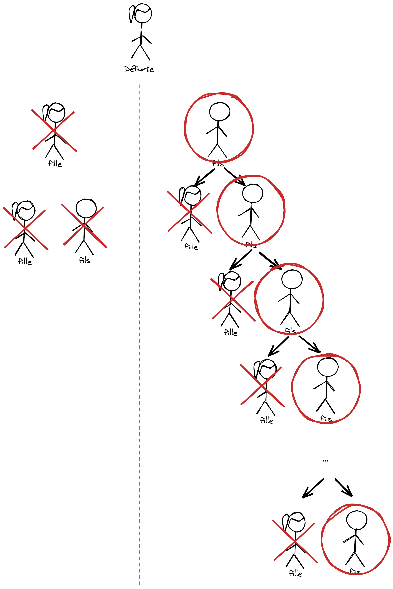
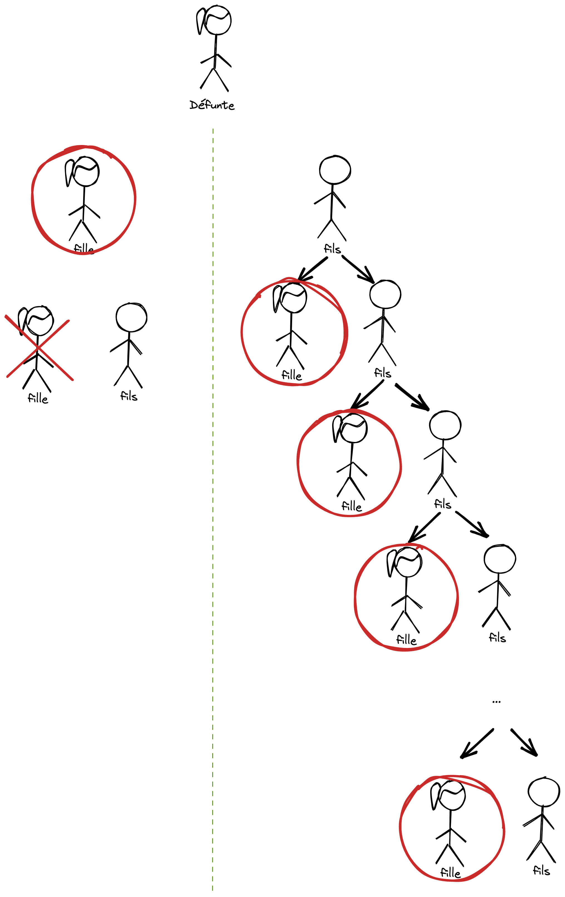
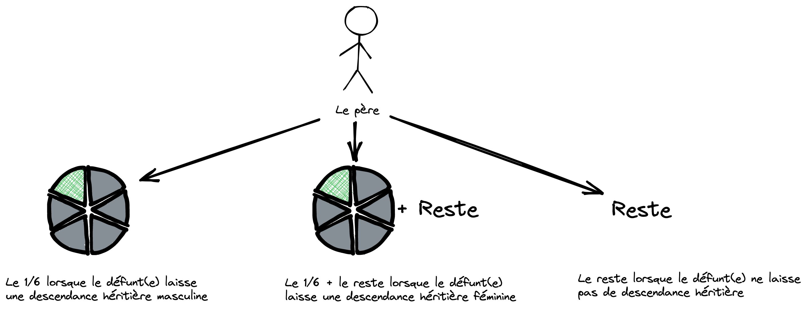

# Le grand-père paternel

## Définition

Le grand-père (GP) est appelé par les fouqahas par le nom de « vrai grand père paternel » (VGPP). 

La finalité de cette identification est de définir si le grand-père fait **partie ou non des héritiers**.

Dit aussi « djad el rahimi » (grand-père utérin par opposition au grand père « 3asabi ») c-à-d qu’il est du coté du père sans qu’il y ait une mère qui rentre dans sa filiation.

## Situation (3 cas)

> Dans le Coran : il n’y a **aucune information propre aux grand-pères**. Il n'est pas explicitement nommé.
On trouve « abawayne » soit le père et la mère. En arabe, le mot « père » est le père direct du défunt, mais aussi le
GP, le GPP... soit toute l’ascendance. Le GP est héritier **en qualité de père**.

> ⚠️Le grand-père **ne fait pas partie des héritiers** pas lorsque le defunt(e) laisse son père.

### Il hérite du 1/6 de l'héritage

Lorsque le défunt(e) laisse une descendance héritière masculine.

### Il hérite du 1/6 et du reste

> Note: Reste = c’est le reste après avoir donné à chacun sa part légale (mentionné dans le Coran & Sunna)

Lorsque le défunt(e) laisse une descendance héritière féminine.

### Il hérite du reste

Lorsque le défunt(s) ne laisse pas de descendance héritière.

> ℹ️ Rappel : Lorsque le grand-père est héritier, les situations sont les mêmes que le père pusiqu'il hérite en qualité de père
