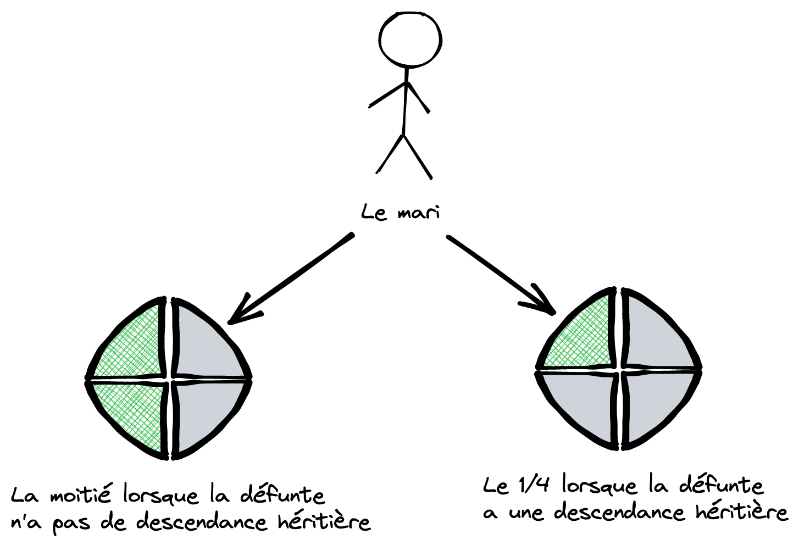

# Le mari

## Situation (2 cas)

### Il hérite de la moitié (1/2) du patrimoine

Lorsque la défunte **n'a pas de descendance héritière**

### Il hérite du 1/4 du patrimoine

Lorque la défunte a une descendance héritière.

> **Note:** La mari doit être marié et doit avoir un contrat de mariage valide.

