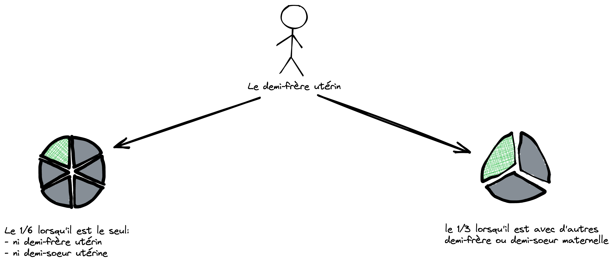

# Le demi-frère maternel ou frère utérin

> ⚠️ Le frère utérin **est empêché d'hériter** lorsque le défunt(e) laisse :
> - Une descendance héritière féminine et/ou masculine
> - Une ascendance héritière masculine
>
> _ex: Le défunt(e) laisse son père ou un descendant héritier donc le frère utérin ne peut pas hériter_

## Situation (2 cas)

### Il hérite du 1/6

Lorsque c'est le seul frère utérin. Plus précisément, c'est lorsque le demi-frère
n'a ni demi-frère utérin ou demi-sœur utérine en dehors du défunt(e).

### Il hérite du 1/3

Lorsque le défunt(e) laisse plusieurs demi-frères ou demi-sœurs maternels.

> Le 1/3 sera partagé entre eux.

