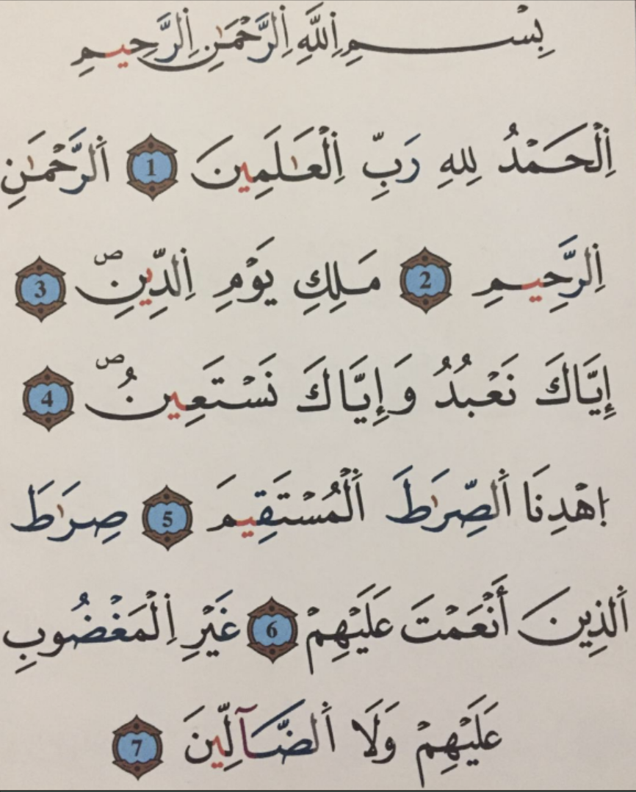
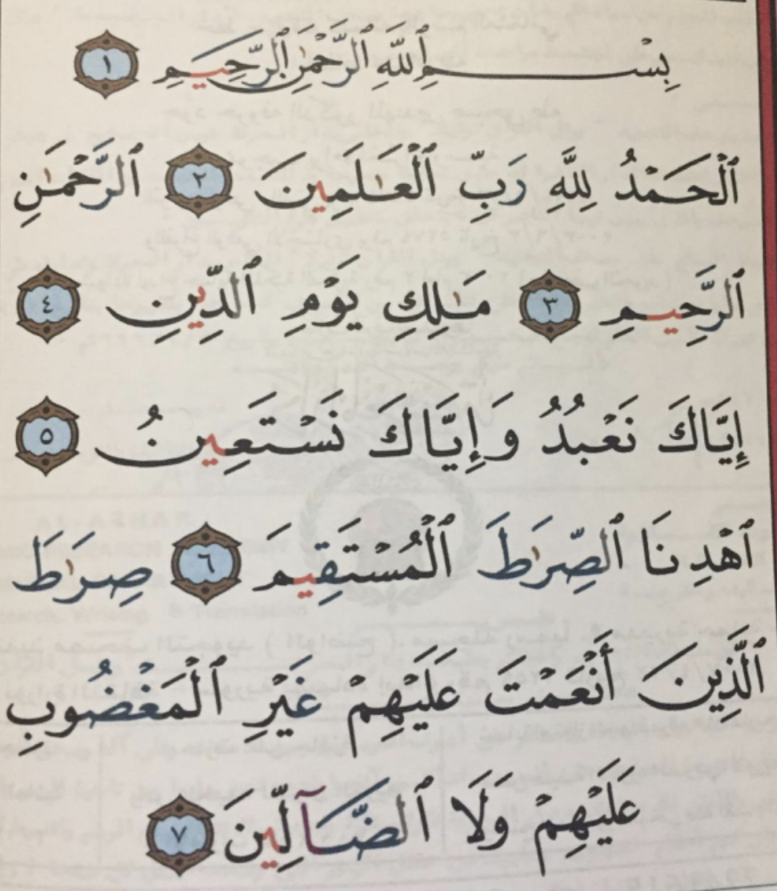

# La fatiha

## Introduction

La Fatiha contient **toujours 7 versets**. Que ce soit en comptant la basmallah ou non.

_« Nous t’avons certes donné "les sept versets que l’on répète", ainsi que le Coran sublime. » (Hijr:87)_

Si on la compte, le dernier verset _« sirata ... »_ jusqu’à la fin ne sera pas coupé, tandis que si on ne tient pas
compte de la basmallah, alors nous avons une séparation de versets entre _« ’alayhim »_ et _« ghayri »._

Le verset dit _« sirata ladhnina ane ‘amta ‘aleyhim ghayri. »_ Or, dans la langue arabe et dans les règles du tadjweed,
on ne commence pas la récitation par un mot qui finit par la kasra. Sauf, si le mot se trouve au début d’un verset.

Il est établi que le Prophète sws lisait verset par verset, donc ceci ne pose pas de problème.

### La fatiha sans basmallah (version warch)

### La fatiha avec basmallah (version hafs)

## Statut juridique de la basmallah pendant la prière

### On récite la basmallah pour la fatiha

| École     | Avis                                                                                                                                                                     |
|-----------|--------------------------------------------------------------------------------------------------------------------------------------------------------------------------|
| Malikite  | **NON** (recommandés pour prières surérogatoires)                                                                                                                        |
| Hanafite  | **OUI** à voix basse                                                                                                                                                     |
| Shafi'ite | **OUI** obligatoire à voix haute (quand prière à vois haute) et à voix basse (quand prière à vois basse) car la fatiha est une obligation et la basmallah en fait partie |
| Hanbalite | **OUI** à voix basse de manière générale (La réciter à voix haute ne fait pas partie de la Sunna)                                                                        |

### On récite la basmallah au début de chaque sourate

| École     | Avis                                                                                                     |
|-----------|----------------------------------------------------------------------------------------------------------|
| Malikite  | **NON** (recommandés pour prières surérogatoires)                                                        |
| Hanafite  | **NON Obligatoire** mais c'est bien de le faire                                                          |
| Shafi'ite | **OUI** obligatoire à voix haute (quand prière à vois haute) et à voix basse (quand prière à vois basse) |
| Hanbalite | **OUI** à voix basse de manière générale (La réciter à voix haute ne fait pas partie de la Sunna)        |

### Statut juridique de la récitation de la Fatiha pendant la prière

> C'est un élément constitutif de la Prière, quiconque la délaisse en étant
> capable de la réciter invalide sa Prière. (On peut toujours la rattraper avec soujoud saho avec quelques conditions)
_Avis probant_

| École     | Avis                                                                                                                                                                                                                                                            |
|-----------|-----------------------------------------------------------------------------------------------------------------------------------------------------------------------------------------------------------------------------------------------------------------|
| Malikite  | **OUI Obligatoire (Rukn)**                                                                                                                                                                                                                                      |
| Hanafite  | **NON (Wajib)** Prière valide sans la Fatiha bien qu'il s'agit d'une mauvaise chose. Obligatoire de réciter quelques versets d'une manière générale (min. 3 courts ou 1 long). [AT-THAWRI](https://fr.wikipedia.org/wiki/Sufy%C4%81n_al-Thawr%C4%AB) a cet avis |
| Shafi'ite | **OUI Obligatoire (Rukn)**                                                                                                                                                                                                                                      |
| Hanbalite | **OUI Obligatoire (Rukn)**                                                                                                                                                                                                                                      |

### Le prieur derrière l'imam doit-il réciter la fatiha ?

> **CONSENSUS:** Le retardataire rejoint le groupe alors que l'imam est en inclinaison la récitation de l'imam le
> dispense de réciter la Fatiha.

#### Lors de la prière à voix haute

| École     | Avis                                                                                                                           |
|-----------|--------------------------------------------------------------------------------------------------------------------------------|
| Malikite  | **NON** Sunna de se taire _« Et quand on récite le Coran, prêtez-lui l'oreille attentivement et observez le silence »_ (2:204) |
| Hanafite  | **NON** Makrouh tahrimane                                                                                                      |
| Shafi'ite | **OUI** _« Point de Prière complète pour quiconque prie sans réciter la fatiha »._                                             |
| Hanbalite | **NON** makrouh                                                                                                                |

#### Lors de la pière à voix basse

| École     | Avis                                       |
|-----------|--------------------------------------------|
| Malikite  | **OUI** mandoub (préférable) de le réciter |
| Hanafite  | **NON** Makrouh tahrimane                  |
| Shafi'ite | **OUI**                                    |
| Hanbalite | **OUI** recommandé                         |

> Al Qortobi rapporte de l'imam Malik:
> _Pour la Prière à voix basse, il récite la fatiha et s'il la délaisse, il s'est mal conduit (il a délaissé le
mandoub), mais il n'est pas coupable de péché._
